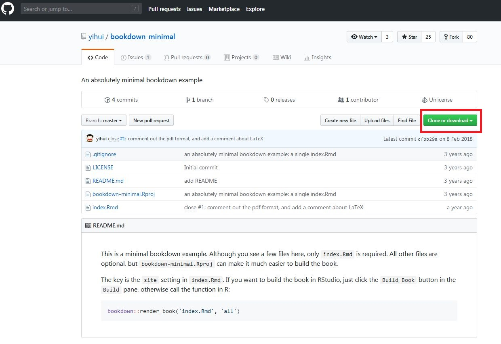

# はじめに {-#hajime}

```{r cover, echo=FALSE,  out.width='60%'}

```

(`r format(Sys.time(), '%Y/%m/%d')`現在)

* 何も考えずにとりあえずbookdownでファイルを作ってみる
  
* bookdownで作られた有名な例
    + [R for Data Science](https://r4ds.had.co.nz/)
    + [元のマークダウンファイルなど](https://github.com/hadley/r4ds)

* 詳しくは公式ドキュメント参照
    + [bookdown: Authoring Books and Technical Documents with R Markdown](https://bookdown.org/yihui/bookdown/)
    + [元のマークダウンファイルなど](https://github.com/rstudio/bookdown/tree/master/inst/examples)

## サンプルの最小構成プロジェクトをダウンロード {-#hajime_dl}

```{r eval=FALSE}
# パッケージが入っていない方はまずインストール
install.packages("bookdown")
```

https://github.com/yihui/bookdown-minimal

の

  Clone or download > Download ZIP

でダウンロードしたファイルを解凍する

(ref:github) Clone or downloadの場所

```{r github, echo=FALSE, fig.align='center', fig.cap='(ref:github)', out.width='70%'}

```

## プロジェクトファイルを開く {-#hajime_open}

解凍したフォルダ内のプロジェクトファイル`bookdown-minimal.Rproj` を実行

## Build Bookする {-#hajime_bb}

右上ペインのBuildタブを開き，`Build Book`を押す

(ref:migiue) Build Bookの場所

```{r migiue, echo=FALSE, fig.align='center', fig.cap='(ref:migiue)', out.width='70%'}
knitr::include_graphics("images/migiue.JPG")
```

* ここまでで最小構成版は完成。ここの時点ではまだ`_bookdown.yml`や`_output.yml`はなくても大丈夫みたい

## 最小構成から色々追加していくために {-#hajime_add}

* [1 章の追加](#intro)からを参照
* 追加される章のrmdファイルの順番や，必要なフォルダ名の命名のため等に`_bookdown.yml`の作成が必要
